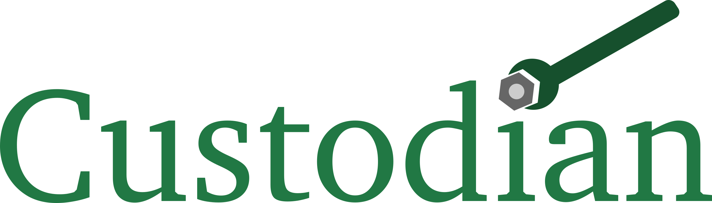

[](https://github.com/materialsproject/custodian/blob/main/LICENSE)
[](https://github.com/materialsproject/custodian/workflows/Linting/badge.svg)
[](https://github.com/materialsproject/custodian/actions/workflows/pytest.yml)
[](https://pepy.tech/project/custodian)
[](https://codecov.io/gh/materialsproject/custodian)

Custodian is a simple, robust and flexible just-in-time (JIT) job management
framework written in Python. Using custodian, you can create wrappers that
perform error checking, job management and error recovery. It has a simple
plugin framework that allows you to develop specific job management workflows
for different applications.

Error recovery is an important aspect of many *high-throughput* projects that
generate data on a large scale. When you are running on the order of hundreds
of thousands of jobs, even an error-rate of 1% would mean thousands of errored
jobs that would be impossible to deal with on a case-by-case basis.

The specific use case for custodian is for long running jobs, with potentially
random errors. For example, there may be a script that takes several days to
run on a server, with a 1% chance of some IO error causing the job to fail.
Using custodian, one can develop a mechanism to gracefully recover from the
error, and restart the job with modified parameters if necessary.

The current version of Custodian also comes with several sub-packages for error
handling for Vienna Ab Initio Simulation Package (VASP), NwChem, QChem, FEFF, Lobster and CP2K
calculations.

# Getting custodian

## Stable version

The version at the Python Package Index (PyPI) is always the latest stable release that will be hopefully, be
relatively bug-free. Install as follows:

```sh
pip install custodian
```

Some plugins (e.g., VASP management) require additional setup (please see [pymatgen docs]).

## Developmental version

The bleeding edge developmental version is at the custodian's [Github repo](https://github.com/materialsproject/custodian). The developmental
version is likely to be more buggy, but may contain new features. The Github version include test files as well for
complete unit testing. After cloning the source, you can type

```sh
python setup.py install
```

or to install the package in developmental mode::

```sh
python setup.py develop
```

# Requirements

Custodian supports Python 3.8+. There are no other required dependencies. However, if you wish to use many of the
built-in error handlers and Jobs for VASP, NWChem, QChem, etc., you will likely need pymatgen to be installed as well.

# Usage

Please refer to the official [custodian docs] for details on how to use
custodian.

# How to cite custodian

If you use custodian in your research, especially the VASP component, please
consider citing the following work:

```
Shyue Ping Ong, William Davidson Richards, Anubhav Jain, Geoffroy Hautier,
Michael Kocher, Shreyas Cholia, Dan Gunter, Vincent Chevrier, Kristin A.
Persson, Gerbrand Ceder. *Python Materials Genomics (pymatgen) : A Robust,
Open-Source Python Library for Materials Analysis.* Computational
Materials Science, 2013, 68, 314-319. doi:10.1016/j.commatsci.2012.10.028
```

# License

Custodian is released under the MIT License. The terms of the license are as
follows:

```txt
The MIT License (MIT)
Copyright (c) 2011-2012 MIT & LBNL

Permission is hereby granted, free of charge, to any person obtaining a
copy of this software and associated documentation files (the "Software"),
to deal in the Software without restriction, including without limitation
the rights to use, copy, modify, merge, publish, distribute, sublicense,
and/or sell copies of the Software, and to permit persons to whom the
Software is furnished to do so, subject to the following conditions:

The above copyright notice and this permission notice shall be included in
all copies or substantial portions of the Software.

THE SOFTWARE IS PROVIDED "AS IS", WITHOUT WARRANTY OF ANY KIND, EXPRESS OR
IMPLIED, INCLUDING BUT NOT LIMITED TO THE WARRANTIES OF MERCHANTABILITY,
FITNESS FOR A PARTICULAR PURPOSE AND NONINFRINGEMENT. IN NO EVENT SHALL THE
AUTHORS OR COPYRIGHT HOLDERS BE LIABLE FOR ANY CLAIM, DAMAGES OR OTHER
LIABILITY, WHETHER IN AN ACTION OF CONTRACT, TORT OR OTHERWISE, ARISING
FROM, OUT OF OR IN CONNECTION WITH THE SOFTWARE OR THE USE OR OTHER
DEALINGS IN THE SOFTWARE.
```

[pymatgen docs]: http://pymatgen.org/
[custodian docs]: https://materialsproject.github.io/custodian/
